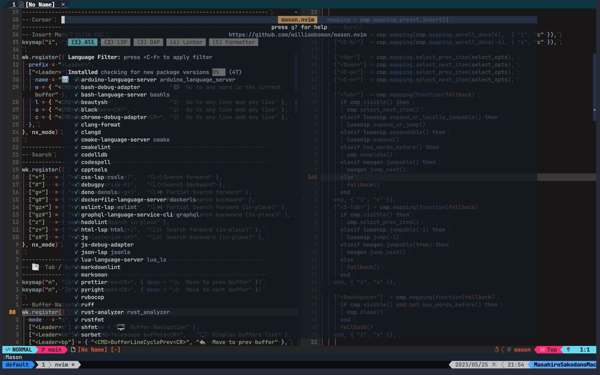
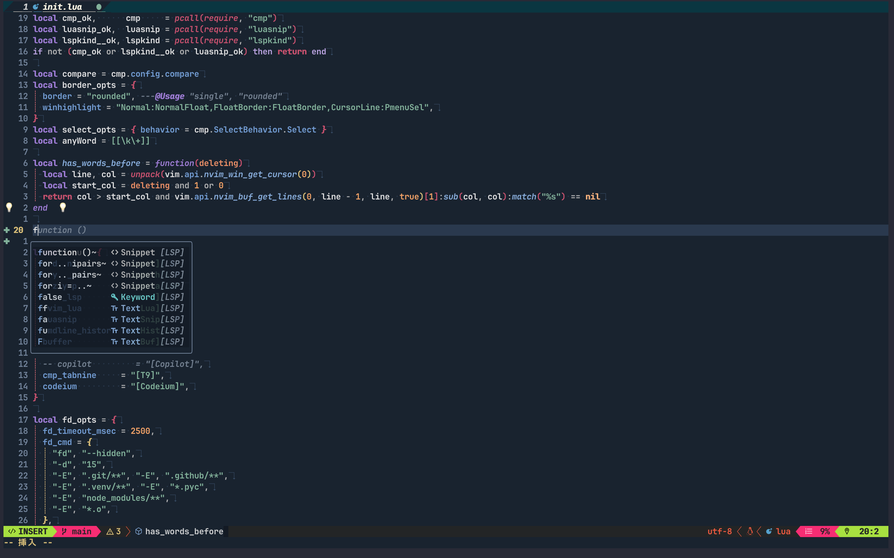
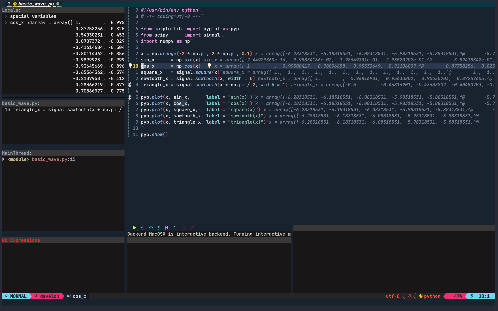
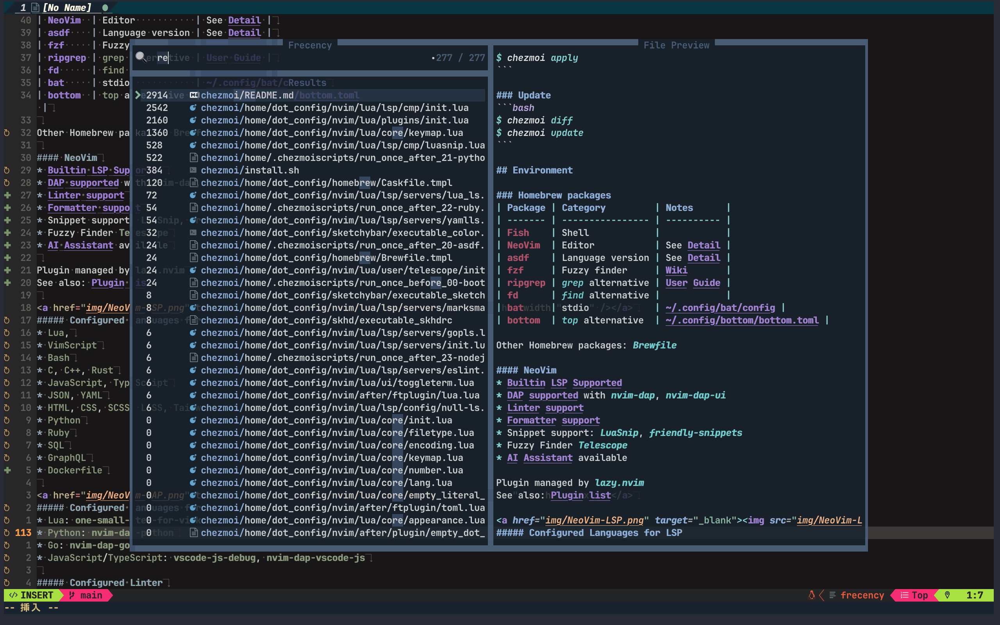

<div align="center">
  <p>&nbsp;</p>
  

  <h1>dotfiles</h1>
  
  <p>Bootstrap & build macOS development environment</p>

  [![chezmoi][chezmoi-badge]][chezmoi-website]
  [![license][license-badge]][license-file]
  [](https://github.com/MasahiroSakoda/dotfiles/graphs/commit-activity)

  [chezmoi-website]: https://github.com/twpayne/chezmoi
  [chezmoi-badge]: https://img.shields.io/badge/Powered%20by-chezmoi-blue.svg
  [license-badge]: https://img.shields.io/github/license/MasahiroSakoda/dotfiles
  [license-file]: https://github.com/MasahiroSakoda/dotfiles/blob/main/LICENSE

  [](https://github.com/MasahiroSakoda/dotfiles/actions/workflows/codacy.yml)
  [](https://github.com/MasahiroSakoda/dotfiles/actions/workflows/ci.yml)
  [](https://github.com/MasahiroSakoda/dotfiles/actions/workflows/lint.yml)
</div>

## Table of Contents
* [Features](#features)
* [Getting Started](#Getting-Started)
* [Usage](#Usage)
  * [Configure dotfiles](#Configure-dotfiles)
  * [Apply changes](#Apply-changes)
  * [Update](#Update)
* [Environment](#Environment)
  * [Homebrew packages](#Homebrew-packages)
    * [fish shell](#fish-shell)
    * [NeoVim](#NeoVim)
      * [Configured Languages for LSP](#Configured-Languages-for-LSP)
      * [Configured Languages for DAP](#Configured-Languages-for-DAP)
      * [Configured Linter](#Configured-Linter)
      * [Configured Formatter](#Configured-Formatter)
    * [asdf](#asdf)
  * [Homebrew cask packages](#Homebrew-cask-packages)
  * [App Store apps](#App-Store-apps)
* [ToDo](#ToDo)

---

## Features
* One Line Install
* dotfiles management using [**`chezmoi`**](https://github.com/twpayne/chezmoi)

## Getting Started
```bash
$ curl -fsSL https://raw.githubusercontent.com/MasahiroSakoda/dotfiles/main/install.sh | bash
```

## Usage

### Configure dotfiles
```bash
$ chezmoi edit $DOTFILES
```

### Apply changes
```bash
$ chezmoi apply
```

### Update
```bash
$ chezmoi diff
$ chezmoi update
```

## Environment

### Homebrew packages
| Package | Category         | Notes      |
| ------- | ---------------- | ---------- |
| [**Fish**](https://github.com/fish-shell/fish-shell)    | Shell            |            |
| [**tmux**](https://github.com/tmux/tmux)    | Screen           | [~/.config/tmux/tmux.conf](https://github.com/MasahiroSakoda/dotfiles/blob/main/home/dot_config/tmux/tmux.conf.tmpl) |
| [**NeoVim**](https://github.com/neovim/neovim)  | Editor           | See [Detail](#NeoVim) |
| [**asdf**](https://github.com/asdf-vm/asdf)    | Language version | See [Detail](#asdf) |
| [**fzf**](https://github.com/junegunn/fzf)     | Fuzzy finder     | [Wiki](https://github.com/junegunn/fzf/wiki)       |
| [**ripgrep**](https://github.com/BurntSushi/ripgrep) | `grep` alternative | [User Guide](https://github.com/BurntSushi/ripgrep/blob/master/GUIDE.md) |
| [**fd**](https://github.com/sharkdp/fd)      | `find` alternative |            |
| [**bat**](https://github.com/sharkdp/bat)     | `cat` alternative  | [~/.config/bat/config](https://github.com/MasahiroSakoda/dotfiles/blob/main/home/dot_config/bat/config) |
| [**bottom**](https://github.com/ClementTsang/bottom)  | `top` alternative  | [~/.config/bottom/bottom.toml](https://github.com/MasahiroSakoda/dotfiles/blob/main/home/dot_config/bottom/bottom.toml) |

Other Homebrew packages: [**`Brewfile`**](https://github.com/MasahiroSakoda/dotfiles/blob/main/home/dot_config/homebrew/Brewfile.tmpl)

#### fish shell
| Plugin                        | Notes            |
| ----------------------------- | ---------------- |
| [jorgebucaran/fisher](https://github.com/jorgebucaran/fisher)           | A plugin manager for Fish |
| [oh-my-fish/theme-bobthefish](https://github.com/oh-my-fish/theme-bobthefish)   | A Powerline-style, Git-aware fish theme optimized for awesome. |
| [jethrokuan/fzf](https://github.com/jethrokuan/fzf)                | Ef-🐟-ient fish keybindings for fzf |
| [jethrokuan/z](https://github.com/jethrokuan/z)                  | Pure-fish z directory jumping |
| [dracula/fish](https://github.com/dracula/fish)                  | 🧛🏻‍♂️ Dark theme for fish |
| [franciscolourenco/done](https://github.com/franciscolourenco/done)        | A fish-shell package to automatically receive notifications when long processes finish. |
| [jorgebucaran/autopair.fish](https://github.com/jorgebucaran/autopair.fish)    | Auto-complete matching pairs in the Fish command line |

#### NeoVim
<a href="img/NeoVim-mason.nvim.png" target="_blank"></a>

* [Builtin LSP Supported](#Configured-Languages-for-LSP)
* [DAP supported](#Configured-Languages-for-DAP) with [**`nvim-dap`**](https://github.com/mfussenegger/nvim-dap), [**`nvim-dap-ui`**](https://github.com/rcarriga/nvim-dap-ui)
* [Linter support](#Configured-Linter)
* [Formatter support](#Configured-Formatter)
* Snippet support: [**`LuaSnip`**](https://github.com/L3MON4D3/LuaSnip), [**`friendly-snippets`**](https://github.com/rafamadriz/friendly-snippets)
* [Fuzzy Finder](#Telescope-extensions): [**`Telescope`**](https://github.com/nvim-telescope/telescope.nvim)
* [AI Assistant](#AI-Assistant) available

Plugin managed by [**`lazy.nvim`**](https://github.com/folke/lazy.nvim)
See also: [Plugin list](https://github.com/MasahiroSakoda/dotfiles/blob/main/home/dot_config/nvim/lua/plugins/init.lua)

##### Configured Languages for LSP
<a href="img/NeoVim-LSP.png" target="_blank"></a>
* `Lua`,
* `VimScript`
* `Bash`
* `C`/`C++`,
* `Rust`
* `JavaScript`,
* `TypeScript`
* `JSON`, `YAML`
* `HTML`,
* `CSS`, `SCSS`, `LESS`, `Tailwind CSS`
* `Python`
* `Ruby`
* `SQL`
* `GraphQL`
* `Dockerfile`

<a href="img/NeoVim-DAP.png" target="_blank"></a>
##### Configured Languages for DAP
* `Lua`: [**`one-small-step-for-vimkind`**](https://github.com/jbyuki/one-small-step-for-vimkind)
* `Python`: [**`nvim-dap-python`**](https://github.com/mfussenegger/nvim-dap-python)
* `Go`: [**`nvim-dap-go`**](https://github.com/leoluz/nvim-dap-go)
* `js`/`ts`: [**`vscode-js-debug`**](https://github.com/microsoft/vscode-js-debug), [**`nvim-dap-vscode-js`**](https://github.com/mxsdev/nvim-dap-vscode-js)

##### Configured Linter
| Linter       | Notes                              |
| ------------ | ---------------------------------- |
| [**codespell**](https://github.com/codespell-project/codespell)    | Check code for common misspellings |
| [**hadolint**](https://github.com/hadolint/hadolint)     | `Dockerfile` linter |
| [**markdownlint**](https://github.com/igorshubovych/markdownlint-cli) | `markdown` linter/formatter |
| [**ruff**](https://github.com/charliermarsh/ruff/)         | Fast `Python` Linter |
| [**rubocop**](https://rubocop.org)      | `Ruby` linter/formatter |
| [**vint**](https://github.com/Vimjas/vint)         | `VimScript` linter |
| [**cmakelint**](https://github.com/cmake-lint/cmake-lint)    | `CMake` linter |

##### Configured Formatter
| Formatter     | Notes                      |
| ------------- | -------------------------- |
| [**beautysh**](https://github.com/lovesegfault/beautysh)      | `sh`, `bash`, `zsh` formatter |
| [**black**](https://pypi.org/project/black/)         | Fast `Python` formatter |
| [**clang-format**](https://pypi.org/project/clang-format/)  | `C++`formatter |
| [**jq**](https://github.com/stedolan/jq)            | `JSON` formatter |
| [**prettier**](https://prettier.io)      | Opinionated Code Formatter |
| [**rustfmt**](https://github.com/rust-lang/rustfmt)       | `Rust` formatter |
| [**sql-formatter**](https://sql-formatter-org.github.io/sql-formatter/) | `SQL` formatter |
| [**stylua**](https://github.com/JohnnyMorganz/StyLua)        | `Lua` formatter |
| [**xmlformatter**](https://github.com/pamoller/xmlformatter)  | `XML` formatter |
| [**yamlfmt**](https://github.com/google/yamlfmt)       | `YAML` formatter |


##### Telescope extensions
<a href="img/NeoVim-telescope.nvim.png" target="_blank"></a>
* [**telescope-frecency**](https://github.com/nvim-telescope/telescope-frecency.nvim): [`Frecency algorithm`](https://web.archive.org/web/20210421120120/https://developer.mozilla.org/en-US/docs/Mozilla/Tech/Places/Frecency_algorithm) search
* [**telescope-file-browser**](https://github.com/nvim-telescope/telescope-file-browser.nvim): File Browser
* [**telescope-lazy**](https://github.com/tsakirist/telescope-lazy.nvim): [`lazy.nvim`](https://github.com/folke/lazy.nvim) extension
* [**telescope-tabs**](https://github.com/LukasPietzschmann/telescope-tabs): Tab extension
* [**telescope-dap**](https://github.com/nvim-telescope/telescope-dap.nvim): DAP Extension

##### AI Assistant
* [**ChatGPT.nvim**](https://github.com/jackMort/ChatGPT.nvim)
* [**neoai.nvim**](https://github.com/Bryley/neoai.nvim)

#### asdf
Programming language version management tool
* [**`asdf-python`**](https://github.com/asdf-community/asdf-python)
  * [`Poetry`](https://github.com/python-poetry/poetry)
* [**`asdf-ruby`**](https://github.com/asdf-vm/asdf-ruby)
* [**`asdf-nodejs`**](https://github.com/asdf-vm/asdf-nodejs)
* [**`asdf-deno`**](https://github.com/asdf-community/asdf-deno)

### Homebrew cask packages
#### Keyboard
| Package             | Configuration files |
| ------------------- | ------------------- |
| [**Karabiner-Elements**](https://karabiner-elements.pqrs.org/)  | [~/.config/karabiner](https://github.com/MasahiroSakoda/dotfiles/blob/main/home/dot_config/private_karabiner) |
| [**Hammerspoon**](https://www.hammerspoon.org/)         | [~/.hammerspoon](https://github.com/MasahiroSakoda/dotfiles/tree/main/home/dot_hammerspoon)      |

#### Fonts
| Package                        | Notes                           |
| ------------------------------ | ------------------------------- |
| [**font-codicon**](https://github.com/microsoft/vscode-codicons)                   | Icon Font                       |
| [**font-hack-nerd-font**](https://github.com/ryanoasis/nerd-fonts)            | Nerd Font                       |
| [**font-cica**](https://github.com/miiton/Cica)                      | Monospaced Font for Japanese    |
| [**font-hackgen**](https://github.com/yuru7/HackGen)                   | Programming Font for Japanese   |
| [**font-hackgen-nerd**](https://github.com/yuru7/HackGen)              | Programming Font for Japanese   |
| [**font-jetbrains-mono-nerd-font**](https://www.jetbrains.com/ja-jp/lp/mono/)  | Open Source Font                |
| [**font-plemol-jp-nf**](https://github.com/yuru7/PlemolJP)              | IBM Plex base Font for Japanese |
| [**font-plemol-jp-nfj**](https://github.com/yuru7/PlemolJP)             | IBM Plex base Font for Japanese |

#### Dev
| Package            | Category   |
| ------------------ | ---------- |
| [**iTerm2**](https://iterm2.com/)             | Terminal   |
| [**Alacritty**](https://github.com/alacritty/alacritty)          | Terminal |
| [**Visual Studio Code**](https://code.visualstudio.com/) | IDE        |
| [**Docker**](https://www.docker.com/)             | Container  |
| [**TablePlus**](https://tableplus.com/)          | Database   |
| [**drawio**](https://www.drawio.com/)             | Diagram    |
| [**wireshark-chmodbpf**](https://www.wireshark.org/) | Network    |
| [**TunnelBear**](https://www.tunnelbear.com/)         | VPN        |

Other Homebrew cask packages: [**`Caskfile`**](https://github.com/MasahiroSakoda/dotfiles/blob/main/home/dot_config/homebrew/Caskfile.tmpl)

### App Store apps
See [**`Masfile`**](https://github.com/MasahiroSakoda/dotfiles/blob/main/home/dot_config/homebrew/Masfile.tmpl)

## ToDo
* [ ] Fix script attributes in [**`.chezmoiscripts`**](https://github.com/MasahiroSakoda/dotfiles/tree/main/home/.chezmoiscripts)
* [ ] VSCode support
* [ ] Cross platform support
* [ ] activate switching for personal/work usage
